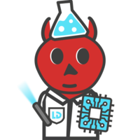

<p align="center">
  
</p>

# LabDaemon

LabDaemon is a Python framework for instrument control and experiment automation. You write device drivers and tasks once, and can run them in scripts, GUIs, and web interfaces.

LabDaemon orchestrates multi-device tasks, threading, lifecycles, and optional server access, so you can easily build complex experiments.

## Core Features

- Plain Python classes: No framework inheritance required
- Progressive complexity: Start local, add server when needed
- Thread-safe by default: Automatic per-device locking
- Device abstraction: Write experiment logic decoupled from device specifics

## Optional Server Feature

Add HTTP/SSE server for remote access and multi-client coordination with `labdaemon.server`:

- Exposes daemon via HTTP API for remote control
- Real-time data streaming with Server-Sent Events
- Device ownership enforcement to prevent conflicts
- Use from scripts, GUIs, or web interfaces
- Deploy on lab networks for shared instrument access

## Quick Example

```python
import labdaemon as ld

# Local script
daemon = ld.LabDaemon()
daemon.register_plugins(devices={"MyLaser": MyLaser})

with daemon.device_context("laser1", "MyLaser", address="GPIB0::1") as laser:
    laser.set_wavelength(1550.0)

# Add server for remote access
from labdaemon.server import LabDaemonServer
server = LabDaemonServer(daemon, port=5000)
server.start()
```

## Next Steps

- [Magic 🪄✨](magic.md) - Understand *why* labdaemon, and it's hidden/background operations. 
- [Concepts](concepts.md) — Understand the key objects and abstractions
- [Quick Start](quick_start.md) — Five-minute introduction
- [Core API](core_api.md) — Complete Python API reference
